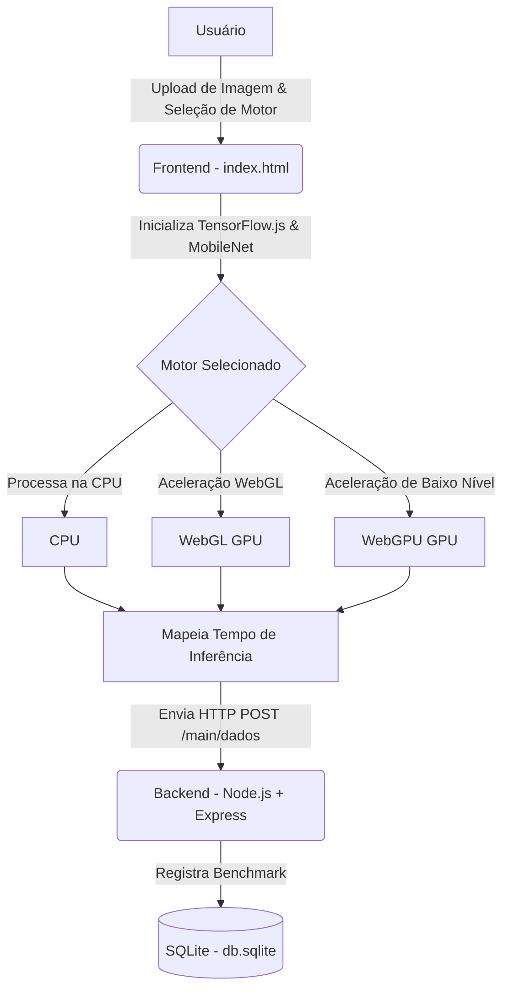

# Benchmark de IA no Navegador: CPU vs GPU (WebGL & WebGPU) 🚀
> **Projeto de Trabalho de Conclusão de Curso (TCC)**

Este repositório contém o código-fonte de um projeto experimental de TCC desenvolvido para **comparar o desempenho de modelos de Inteligência Artificial (Deep Learning) executados diretamente no navegador do usuário (client-side)**, avaliando diferentes motores de processamento (CPU vs. GPU via WebGL e WebGPU) e registrando métricas de tempo de inferência em um banco de dados persistente.

---

## 🎯 Objetivo do Projeto

Tradicionalmente, a inferência de modelos de Deep Learning pesados ocorre no lado do servidor (*backend*): o cliente envia uma imagem ou dado, o servidor processa (muitas vezes utilizando GPUs caras em nuvem) e retorna o resultado. 

Este projeto investiga a viabilidade de **descentralizar esse processamento**, executando o modelo diretamente no hardware do próprio cliente através de tecnologias web modernas. O foco principal é avaliar e comparar o desempenho (medido em tempo de inferência em milissegundos) entre:
*   **CPU:** Processamento padrão feito de forma sequencial ou multithread clássica no processador.
*   **WebGL:** Aceleração gráfica convencional usando APIs de renderização padrão suportadas na maioria dos navegadores.
*   **WebGPU:** A nova API de gráficos e computação para a web, oferecendo acesso de baixo nível muito mais eficiente às GPUs modernas.

---

## 🏗️ Arquitetura do Sistema

O sistema é dividido em duas partes fundamentais: um **Frontend** interativo que realiza a inferência em tempo de execução local, e um **Backend** leve para persistência e catalogação de dados dos testes realizados.



---

## 💻 Frontend (Cliente)

Localizado no diretório `/frontend`, o frontend consiste em uma aplicação de página única (*Single Page Application* - SPA) construída com tecnologias web nativas para garantir o mínimo de overhead no benchmark.

### Componentes Principais
*   **TensorFlow.js (tfjs):** Framework principal responsável por carregar o modelo e orquestrar os tensores e tensores de computação gráfica.
*   **TensorFlow.js WebGPU Backend:** Driver de execução experimental que mapeia as operações matemáticas do modelo diretamente na API WebGPU nativa do navegador.
*   **MobileNet v2:** Modelo de rede neural convolucional (CNN) pré-treinado carregado dinamicamente para classificação de imagens de propósito geral (1000 categorias).
*   **Coletor de Especificações de Hardware & Software:** Script utilitário em JavaScript que detecta automaticamente detalhes do ambiente cliente (SO, Navegador, Placa de Vídeo/GPU via WebGL, Núcleos de CPU e RAM instalada).

### Fluxo de Trabalho
1.  **Carregamento Inicial**: O usuário abre a página e o frontend cronometra o tempo de download do MobileNet via CDN e sua inicialização.
2.  **Upload da Imagem**: O usuário carrega uma imagem (`png` ou `jpeg`).
3.  **Seleção do Motor**: Seleciona o motor de inferência desejado (`cpu`, `webgl` ou `webgpu`).
4.  **Setup do Motor**: O frontend reconfigura o backend do TF.js em tempo real através de `tf.setBackend()` e aguarda a inicialização via `tf.ready()`, medindo o tempo dessa etapa.
5.  **Warm-up (Aquecimento)**: O script realiza a primeira inferência e mede seu tempo de forma isolada (`tempo_warmup`), isolando a compilação JIT de shaders/kernels. Mais duas execuções de aquecimento são feitas e descartadas.
6.  **Inferências Estáveis (Hot Runs)**: O frontend executa 10 inferências consecutivas com pausas de renderização (`tf.nextFrame()`) para manter a página responsiva e calcula a média aritmética do tempo (`tempo`).
7.  **Coleta de Heap de JS**: Usando a API `performance.memory` (apenas em navegadores baseados em Chromium), mede o heap de JS antes e depois da inferência para computar o delta de consumo de memória.
8.  **Exibição & Envio**: Os resultados são apresentados em um dashboard moderno e enviados por POST HTTP para persistência no banco SQLite.

---

## 🎛️ Backend (Servidor de Métricas)

Localizado no diretório `/backend`, o backend foi estruturado em Node.js utilizando o padrão de arquitetura MVC simples (Model-View-Controller) para receber e organizar as estatísticas de desempenho coletadas pelos usuários.

### Tecnologias Utilizadas
*   **Node.js & Express.js:** Criação do servidor HTTP e rotas de API REST de alta performance.
*   **SQLite3:** Banco de dados relacional leve e local que armazena os registros em arquivo físico local (`db.sqlite`) sem necessidade de configurar instâncias pesadas de banco de dados.
*   **CORS:** Habilitado para permitir comunicações seguras entre a origem do frontend e a porta do backend.

### Estrutura do Banco de Dados
A tabela `benchmarks` é criada automaticamente ao iniciar o backend e possui a seguinte estrutura (as colunas de hardware e software são adicionadas dinamicamente via rotina de migração automática ao ligar o servidor, garantindo a compatibilidade retroativa):

| Campo | Tipo | Descrição |
| :--- | :--- | :--- |
| `id` | `INTEGER` | Chave primária auto-incrementada. |
| `motor` | `TEXT` | O motor utilizado no teste (`cpu`, `webgl` ou `webgpu`). |
| `tempo` | `REAL` | Tempo médio de inferência de regime permanente (hot runs) em milissegundos. |
| `resultados` | `TEXT` | String JSON contendo os maiores índices de predição do modelo MobileNet. |
| `criado_em` | `DATETIME` | Registro de data/hora da inferência (padrão `CURRENT_TIMESTAMP`). |
| `so` | `TEXT` | O Sistema Operacional detectado do usuário. |
| `navegador` | `TEXT` | O Navegador utilizado. |
| `ram` | `TEXT` | Capacidade estimada de memória RAM do dispositivo. |
| `cpu_cores` | `TEXT` | Número de processadores/threads lógicas do cliente. |
| `gpu` | `TEXT` | O modelo da placa de vídeo detectado via driver gráfico WebGL. |
| `tempo_load_modelo` | `REAL` | Tempo de download e carga do modelo MobileNet via CDN. |
| `tempo_setup_backend` | `REAL` | Tempo de troca de motor e inicialização do backend no TensorFlow.js. |
| `tempo_warmup` | `REAL` | Tempo da primeira inferência (warm-up / cold run), capturando compilação de shaders e JIT. |
| `memoria_antes` | `REAL` | Tamanho do heap de JavaScript antes da inferência em MB. |
| `memoria_depois` | `REAL` | Tamanho do heap de JavaScript após a inferência em MB. |
| `memoria_diferenca` | `REAL` | Consumo líquido de memória heap alocada em MB. |

### Rotas Disponíveis (`/main`)
*   `POST /main/dados`: Valida e insere um novo registro de benchmark no SQLite.
*   `GET /main/dados`: Recupera todos os benchmarks do banco ordenados cronologicamente (do mais recente ao mais antigo) para uso em análises estatísticas ou gráficos futuros.

---

## 🚀 Como Executar o Projeto

### Pré-requisitos
*   **Node.js** (versão 16 ou superior recomendada)
*   Um navegador moderno compatível com **WebGPU** (Chrome 113+, Edge 113+, Opera) ou **WebGL** para testes acelerados por GPU.

### Passo 1: Configurar e Rodar o Backend

1. Navegue até o diretório do backend:
   ```bash
   cd backend
   ```
2. Instale as dependências:
   ```bash
   npm install
   ```
3. Inicie o servidor em modo de desenvolvimento (usa nodemon para autoreload):
   ```bash
   npm run dev
   ```
   O console exibirá: `Servidor HTTP rodando na porta 3335` e `Conectado ao banco de dados SQLite com sucesso.`

### Passo 2: Executar o Frontend

Como o frontend é puramente estático (`index.html`), você pode:
*   Abrir o arquivo `frontend/index.html` diretamente em seu navegador dando um duplo clique. 
Não é recomendado usar a extensão Live Server devido ao fato do sqlite atualizar e fazer com que a página dê hot reload.

---

## 🔄 Últimas Mudanças (Nova Iteração)

Em uma iteração recente do projeto, foram implementadas melhorias críticas para enriquecer o embasamento acadêmico e técnico do TCC:

1. **Separação de Custos de Carregamento**:
   * O tempo de download inicial do modelo MobileNet da CDN agora é medido de forma independente.
   * O tempo de carregamento e ativação de backend (`tf.setBackend()` + `tf.ready()`) é contabilizado a cada troca de motor.
   * Implementação de rotina de **warm-up (aquecimento)**: a primeira inferência (fria) é isolada como `tempo_warmup`, permitindo analisar individualmente os gargalos de compilação JIT de shaders (principalmente em WebGL e WebGPU). Em seguida, outras duas inferências de aquecimento são executadas e descartadas.
   * As inferências estáveis de latência do sistema são baseadas na **média de 10 execuções quentes**.

2. **Monitoramento de Memória Heap do JS**:
   * Integração com a API de baixo nível `performance.memory` para capturar a memória heap alocada antes e depois de iniciar o fluxo do benchmark.
   * Exibição visual do delta de memória utilizada no dashboard.
   * Tolerância a falhas: em navegadores sem suporte à API (como Firefox e Safari), o sistema detecta e exibe `N/A` amigavelmente, enviando os registros nulos ao backend sem interrupção.

3. **Correção de Congelamento no Motor CPU**:
   * Introdução de esperas assíncronas utilizando `tf.nextFrame()` entre as execuções das inferências.
   * Isso cede o tempo da thread principal de volta ao navegador para que ele processe eventos e atualize a tela, eliminando o congelamento da interface no motor CPU.
   * O botão de ação agora exibe mensagens de progresso ao vivo (ex: `Rodando Inferência (4/10)...`).

4. **Nova Interface Premium**:
   * Design moderno estilo dashboard escuro (Glassmorphism e Neon Accents) que torna os gráficos e tabelas muito mais apresentáveis para o trabalho final.